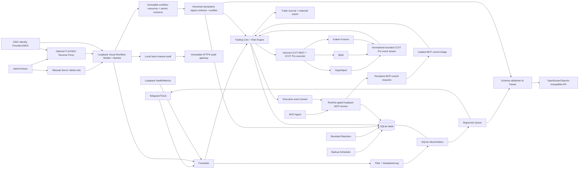

# TSX Core – Architektur und Fitness Functions

## Systemkontext



Trust Boundaries liegen an Telegram/TDLib, der externen KI-API, OIDC/JWKS beziehungsweise Tailscale Serve Identity, allen HTTP-Anfragen an Dashboard/Metriken/MCP, Agenten-Tokens, Prozessumgebung/Secrets, Host-Volumes und Backup-Replikation. Externe Eingaben werden vor einer Nebenwirkung validiert; ein unklarer Zustellstatus wird `unknown` und nie automatisch erneut gesendet. Dashboard, Metriken und MCP bleiben auf Host-Loopback; Tailscale Serve darf sie nur innerhalb des Tailnets veröffentlichen, Funnel ist ausgeschlossen.

## Komponenten und Verantwortungen

| Bereich      | Module                                                                                                                        | Verantwortung                                   |
| ------------ | ----------------------------------------------------------------------------------------------------------------------------- | ----------------------------------------------- |
| Entry Points | `forwarder.ts`, `mcp_server.ts`, `backup_cli.ts`, `migration_cli.ts`, `audit_cli.ts` | Lifecycle und Composition Roots |
| Core | `queue.ts`, `filters.ts`, `signal_schema.ts`, `signal_contract.ts`, `tdlib_retry.ts`, `delivery_tracker.ts`, `dashboard_auth.ts`, `crash_guard.ts`, `metrics_tracker.ts` | deterministische Regeln, Vertragsinterpreter und Zustandsmaschinen |
| State/Config | `db.ts`, `config.ts`, `env.ts`, `runtime_settings.ts`, `secret_store.ts` | persistente Verträge, Migrationen und Konfigurationsgrenzen |
| Adapter | `signal_parser.ts`, `web_server.ts`, `metrics.ts`, `logger.ts`, `backup.ts`, `backup_replication.ts`, `retention.ts`, `audit_trail.ts` | externe Provider, HTTP, Operator und Filesystem |
| Trading | `workflow_repository.ts`, `trading_types.ts`, `trading_strategy.ts`, `trading_risk.ts`, `trading_channel_risk.ts`, `trading_telemetry.ts`, `trading_engine.ts`, `trading_repository.ts`, `trading_runtime.ts`, `trading_web_control.ts`, `trading_credentials.ts`, `trade_journal.ts` | visuelle Revisionen und Fan-out, Verträge/Profile, pfadisoliertes adaptives Risiko, kontoweite Kapazität, Planung, Lifecycle, Reconciliation und Journal |
| Agenten | `mcp_repository.ts`, `mcp_control_bridge.ts`, `mcp_server.ts` | gehashte Agentenidentitäten, dauerhafte Minimalrechte, Preflight/Freigabe-Vorschläge, Streamable HTTP, Ereignis-Push und auditierte Befehlsübergabe |
| Exchange | `ccxt_exchange.ts`, `exchange_stream_repository.ts`, `paper_exchange.ts`, `exchange_executor/` | Paper-Simulation, CCXT-REST-Grenze, CCXT-Pro-Beschleunigung und fail-closed Implementierungs-Allowlist für Hyperliquid, Bybit und Kraken Futures; externe Testnet-/Produktionszertifizierung bleibt ein separates Release-Gate |

Erlaubte Richtung: `Entry Point → Adapter → Core/State`. Core importiert keine Adapter oder Entry Points. Kein Modul außerhalb des Composition Root importiert einen Entry Point. `db.ts` importiert kein internes Modul. Zirkuläre Imports sind verboten.

`npm run quality:architecture` prüft Auflösbarkeit lokaler Imports, diese Richtungen und Zyklen. Neue Schichten oder Ausnahmen benötigen vorab einen ADR und eine Erweiterung des ausführbaren Gates.

`npm run quality:frontend` startet beim einzigen Browser-Entry-Point `frontend/src/main.tsx`, verlangt Erreichbarkeit jedes produktiven TS/TSX-Moduls und gleicht alle Frontend-Produktivabhängigkeiten mit den tatsächlich erreichbaren Imports ab. Ambient-`*.d.ts`-Dateien und Build-Dependencies sind davon ausgenommen.

## Daten- und Zustellfluss

```text
Telegram update
  -> Inbox-Deduplizierung (chat_id, message_id)
  -> persistenter Outbox-Task: pending
  -> preparing
  -> optionaler AI-Aufruf: strikt validiertes + geerdetes XML
  -> sending
  -> TDLib send-succeeded: completed
  -> Prozessabbruch in sending: unknown (manuelle Reconciliation, kein Auto-Retry)
```

Konfiguration und Runtime-Einstellungen werden atomar via temporärer Datei, `fsync` und Rename geschrieben. Secrets kommen entweder aus externen Environment-/File-Mounts oder aus dem write-only `ManagedSecretStore`; extern verwaltete Werte bleiben im Web schreibgeschützt. Backups enthalten SQLite plus bereinigte Routing-Konfiguration, werden gehasht und vor Veröffentlichung geprüft; verschlüsselte Off-site-Objekte können über die Web-Control-Plane heruntergeladen, entschlüsselt und restore-verifiziert werden. Die Retention bereinigt nur finale Daten in begrenzten Transaktionen; ungeklärte Zustellzustände sind von automatischer Löschung ausgeschlossen.

## Trading-Zustandsfluss

Ein Signalvertrag ist ein eigenständiger, versionierter SQLite-Baustein. Seine deklarative Definition beschreibt XML-Pfade und Typen, Entry-/Target-Form, Zusatzfelder, Long-/Short-Geometrie und die gegen die Telegram-Quelle zu erdenden Werte. Publizierte Versionen bleiben immutable. Im visuellen Workflow bestimmt das Schema die Parserform, während der separat verbundene Vertragsbaustein die konkrete veröffentlichte Definition bestimmt; das im Schema gespeicherte Vertragsfeld bleibt nur der Legacy-Default. Unbekannte, deaktivierte oder nicht publizierte Verknüpfungen sind fail-closed.

Der aktive Signalfluss ist eine immutable Workflowrevision aus typisierten Ressourcen. Kanäle können nach gemeinsamen Filtern/Parsern in mehrere Kontoäste verzweigen. Jeder Ast besitzt eigene Strategie, Positionsgröße und optional eigenes adaptives Risiko. Identische Parser-/Schema-/Vertrags-/Dedupe-Kombinationen werden einmal ausgeführt und danach aufgefächert. Der Duplikatschutz ist auf den unveränderlichen Hash dieser Parser-Pfadgruppe begrenzt, damit abweichende Parser- oder Vertragszweige desselben Telegram-Pakets unabhängig fan-outen. Unvollständige Pfade sind inert; ausführbare Änderungen werden atomar aktiviert und bei destruktiver Wirkung explizit bestätigt.

Schema-v2-Workflowrevisionen unterscheiden normale `flow`-Kanten von kanalbezogenen `account_fallback`-Kanten. Der Compiler erlaubt pro Ursprungskanal ausschließlich lineare, zyklenfreie Kontoketten und fasst ihre Kandidaten zu einer exklusiven Routengruppe zusammen. Nur Rang 0 wird zunächst als Intent materialisiert. Eine exakt identitätsgebundene, nebenwirkungsfreie `SYMBOL_UNAVAILABLE`-Antwort des internen Read-only-Market-Snapshots blockiert diesen Intent und erzeugt atomar Rang n+1; alle anderen Fehler schließen die Kette. Alle Versuche verwenden den ursprünglichen Erstellzeitpunkt als Entry-TTL-Ursprung. Nach bestätigter Marktverfügbarkeit wird die Routengruppe vor dem Submit dauerhaft ausgewählt, sodass ein unklarer Orderausgang niemals eine zweite Börse aktiviert.

Trading-Signale werden nach persistierter Signalvalidierung für jeden vollständigen Workflowast in einen eigenen Trade Intent überführt. Der Intent wird exakt einmal geplant, jede Order besitzt eine deterministische Client-ID, und eine Position wird gemeinsam mit Entry, TP-Staffel und zwingendem Stop persistiert. Das Positionslimit liegt am Börsenkonto und zählt alle aktiven Positionen über Strategien und Kanäle hinweg. Im adaptiven TP-Modus halbiert jeder TP bis zum vorletzten das verbleibende Volumen; der letzte schließt den Rest. Im adaptiven SL-Modus folgt nach TP1/TP2 Break-even und danach TP(i-2). Break-even bezeichnet dabei den bestätigten volumen­gewichteten Fill-Einstieg ohne Gebühren, richtungssicher auf den Price-Tick gerundet, nicht den geplanten Signalpreis.

Teilgefüllte Entries werden bis zur maximal möglichen Entry-Menge geschützt; nach terminaler Füllung werden Stop und TPs exakt auf die reale Position skaliert. Der Reconciler gleicht Orders, Fills und Positionen mit der Exchange ab, passt den Stop an die Restmenge an und verschiebt ihn unabhängig vom Modus nur in Gewinnrichtung. Unbekannte Orderausgänge oder nicht vom System verwaltete Exchange-Exposure sperren neue Entries global.

CCXT Pro liefert normalisierte private Order-, Trade- und Positionsereignisse; öffentliche Ticker/Kerzen dienen der Beobachtung. Die Streams besitzen pro Konto einen begrenzten Cursorpuffer. Event-Schlüssel deduplizieren Wiederholungen, Cursor-Lücken markieren den Zustand als degradiert. Ein zustandsrelevantes Ereignis darf ausschließlich eine erzwungene CCXT-REST-Reconciliation vorziehen; es darf niemals direkt den persistierten Order-/Fill-/Positionszustand mutieren. Periodische REST-Reconciliation bleibt auch bei Socket-Ausfall aktiv und autoritativ.

Das Trade Journal ist eine abgeleitete, read-mostly Sicht über Intents, Signal-/Vertrags-/Strategie-Provenienz, Positionen, Orders, Fills und Execution Events. Nur Review-Notizen, Tags, Bewertung und Review-Status werden separat gespeichert. Exporte hashen Chat-Identitäten, redigieren Quelltext-PII und neutralisieren Tabellenformeln. Ein vorhandener manueller Review schützt die zugehörige Trade-Historie vor operativer Standard-Retention.

Je Workflowpfad kann eine feste, beobachtende oder automatische Risikopolice hinterlegt werden. Wöchentliche, aus geschlossenen managed Trades berechnete Evaluationen empfehlen beziehungsweise setzen eine Risikostufe, reduzieren schwache Pfade oder blockieren sie nach der konfigurierten Serie. Der Zustand ist durch Kanal, Börsenkonto und logischen Risikobaustein isoliert. Manuelle Sperre und Stufenfixierung haben Vorrang; kein Risiko-Baustein kann kontoweite Kapazität, Protective-Stop-Pflicht, Kill-Switch oder Exchange-Reconciliation aufheben.

## MCP-Kontrollfluss

```text
persistenter MCP-Modus `active` -> Bearer-Token -> SHA-256-Agentenprüfung -> aktuelles dauerhaftes Recht
  -> read-only Tool: begrenzte Repository-Abfrage
  -> ungefährliche Entwurfsänderung: Preflight -> auto-genehmigter persistenter Vorschlag
  -> sensible Konfigurationsänderung: Preflight -> wartender Vorschlag -> Admin-Freigabe
  -> unmittelbare Notfallaktion: persistente mcp_control_request
     -> Forwarder-Bridge prüft Runtime/Agent/Recht erneut
     -> Vorab-Audit muss erfolgreich sein
     -> bestehende TradingWebControl-Sicherheitslogik
     -> Abschluss-Audit + persistentes Ergebnis
     -> MCP-Antwort und Agenten-Aktionshistorie
```

Der MCP-Prozess darf keine Exchange-Adapter instanziieren und erhält keinen Docker-Socket. Er startet mit dem Standard-Stack; ein persistenter Singleton-Modus erlaubt `active`, `standby` oder `disabled` und ist ab Werk deaktiviert. Beide nicht aktiven Modi trennen Sitzungen und blockieren neue Claims; Standby bewahrt wartende Arbeit, Disabled schließt noch nicht gestartete Kontrollanforderungen und bereits genehmigte Vorschläge fehlgeschlagen ab. Pro Sitzung werden Clientname, Version, Verbindungs-/Heartbeat-Zeit und Ende erfasst. Vorschläge sind 24 Stunden gültig, werden atomar geclaimt und behalten Preflight, Entscheider, Ergebnis und Fehler dauerhaft. Nach Prozessabbruch werden laufende Vorschläge als fehlgeschlagen markiert und nicht automatisch erneut ausgeführt. Wichtige persistierte Trading-Events werden anhand der Agenten-Abonnements als MCP-Logging-Nachrichten aktiv versendet und pro Ereignis/Agent/Sitzung dedupliziert. Fehlgeschlagene Zustellungen bleiben retryfähig.

## Versionsregeln

- Persistente Schemaänderungen brauchen Migrationstest, Downgrade-/Rollback-Plan und ADR.
- Neue externe HTTP-/Event-Verträge brauchen explizite Versionierung. Das Dashboard-HTTP-API bleibt intern; MCP ist die freigegebene, authentifizierte Agentenschnittstelle und verhandelt seine Protokollversion beim Handshake.
- Prompt, Template, Modell, Schema und Parser-Version bilden gemeinsam den KI-Vertrag.
- Container-Basis und GitHub Actions werden per vollständigem Digest/SHA gepinnt.
