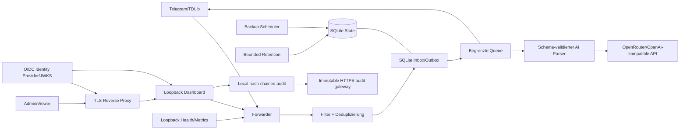

# Architektur und Fitness Functions

## Systemkontext



Trust Boundaries liegen an Telegram/TDLib, der externen KI-API, OIDC/JWKS, allen HTTP-Anfragen an Dashboard/Metriken, Prozessumgebung/Secrets, Host-Volumes und Backup-Replikation. Externe Eingaben werden vor einer Nebenwirkung validiert; ein unklarer Zustellstatus wird `unknown` und nie automatisch erneut gesendet.

## Komponenten und Verantwortungen

| Bereich      | Module                                                                                                                        | Verantwortung                                   |
| ------------ | ----------------------------------------------------------------------------------------------------------------------------- | ----------------------------------------------- |
| Entry Points | `forwarder.ts`, `backup_cli.ts`, `migration_cli.ts`, `audit_cli.ts`                                                                 | Lifecycle und Composition Root                  |
| Core         | `queue.ts`, `filters.ts`, `signal_schema.ts`, `tdlib_retry.ts`, `delivery_tracker.ts`, `dashboard_auth.ts`, `crash_guard.ts`, `metrics_tracker.ts` | deterministische Regeln und Zustandsmaschinen   |
| State/Config | `db.ts`, `config.ts`, `env.ts`                                                                                                | persistente Verträge und Konfigurationsgrenzen  |
| Adapter      | `signal_parser.ts`, `web_server.ts`, `metrics.ts`, `ui.ts`, `backup.ts`, `retention.ts`, `audit_trail.ts`                     | externe Provider, HTTP, Operator und Filesystem |

Erlaubte Richtung: `Entry Point → Adapter → Core/State`. Core importiert keine Adapter oder Entry Points. Kein Modul außerhalb des Composition Root importiert einen Entry Point. `db.ts` importiert kein internes Modul. Zirkuläre Imports sind verboten.

`npm run quality:architecture` prüft Auflösbarkeit lokaler Imports, diese Richtungen und Zyklen. Neue Schichten oder Ausnahmen benötigen vorab einen ADR und eine Erweiterung des ausführbaren Gates.

`npm run quality:frontend` startet beim einzigen Browser-Entry-Point `frontend/src/main.tsx`, verlangt Erreichbarkeit jedes produktiven TS/TSX-Moduls und gleicht alle Frontend-Produktivabhängigkeiten mit den tatsächlich erreichbaren Imports ab. Ambient-`*.d.ts`-Dateien und Build-Dependencies sind davon ausgenommen.

## Daten- und Zustellfluss

```text
Telegram update
  -> Inbox-Deduplizierung (chat_id, message_id)
  -> persistenter Outbox-Task: pending
  -> preparing
  -> optionaler AI-Aufruf: strikt validiertes + geerdetes XML
  -> sending
  -> TDLib send-succeeded: completed
  -> Prozessabbruch in sending: unknown (manuelle Reconciliation, kein Auto-Retry)
```

Konfiguration wird atomar via temporärer Datei, `fsync` und Rename geschrieben. Secrets kommen nur aus der Prozessumgebung. Backups enthalten SQLite plus bereinigte Konfiguration, werden gehasht und vor Veröffentlichung geprüft. Die Retention bereinigt nur finale Daten in begrenzten Transaktionen; ungeklärte Zustellzustände sind von automatischer Löschung ausgeschlossen.

## Versionsregeln

- Persistente Schemaänderungen brauchen Migrationstest, Downgrade-/Rollback-Plan und ADR.
- Neue externe HTTP-/Event-Verträge brauchen explizite Versionierung; derzeit existiert keine freigegebene Public API.
- Prompt, Template, Modell, Schema und Parser-Version bilden gemeinsam den KI-Vertrag.
- Container-Basis und GitHub Actions werden per vollständigem Digest/SHA gepinnt.
