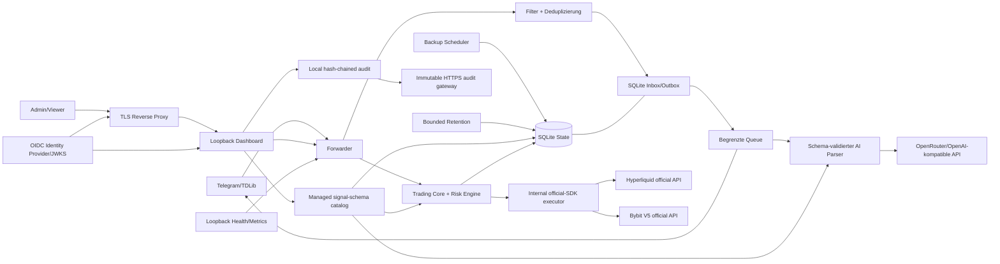

# TSX Core – Architektur und Fitness Functions

## Systemkontext



Trust Boundaries liegen an Telegram/TDLib, der externen KI-API, OIDC/JWKS, allen HTTP-Anfragen an Dashboard/Metriken, Prozessumgebung/Secrets, Host-Volumes und Backup-Replikation. Externe Eingaben werden vor einer Nebenwirkung validiert; ein unklarer Zustellstatus wird `unknown` und nie automatisch erneut gesendet.

## Komponenten und Verantwortungen

| Bereich      | Module                                                                                                                        | Verantwortung                                   |
| ------------ | ----------------------------------------------------------------------------------------------------------------------------- | ----------------------------------------------- |
| Entry Points | `forwarder.ts`, `backup_cli.ts`, `migration_cli.ts`, `audit_cli.ts` | Lifecycle und Composition Root |
| Core | `queue.ts`, `filters.ts`, `signal_schema.ts`, `tdlib_retry.ts`, `delivery_tracker.ts`, `dashboard_auth.ts`, `crash_guard.ts`, `metrics_tracker.ts` | deterministische Regeln und Zustandsmaschinen |
| State/Config | `db.ts`, `config.ts`, `env.ts`, `runtime_settings.ts`, `secret_store.ts` | persistente Verträge, Migrationen und Konfigurationsgrenzen |
| Adapter | `signal_parser.ts`, `web_server.ts`, `metrics.ts`, `logger.ts`, `backup.ts`, `backup_replication.ts`, `retention.ts`, `audit_trail.ts` | externe Provider, HTTP, Operator und Filesystem |
| Trading | `trading_types.ts`, `trading_strategy.ts`, `trading_risk.ts`, `trading_engine.ts`, `trading_repository.ts`, `trading_runtime.ts`, `trading_web_control.ts`, `trading_credentials.ts` | Schema-Profile, Strategieversionen, exakte Planung, Lifecycle und Reconciliation |
| Exchange | `official_exchange.ts`, `paper_exchange.ts`, `exchange_executor/` | Paper-Simulation und offizielle Hyperliquid-/Bybit-SDK-Grenze |

Erlaubte Richtung: `Entry Point → Adapter → Core/State`. Core importiert keine Adapter oder Entry Points. Kein Modul außerhalb des Composition Root importiert einen Entry Point. `db.ts` importiert kein internes Modul. Zirkuläre Imports sind verboten.

`npm run quality:architecture` prüft Auflösbarkeit lokaler Imports, diese Richtungen und Zyklen. Neue Schichten oder Ausnahmen benötigen vorab einen ADR und eine Erweiterung des ausführbaren Gates.

`npm run quality:frontend` startet beim einzigen Browser-Entry-Point `frontend/src/main.tsx`, verlangt Erreichbarkeit jedes produktiven TS/TSX-Moduls und gleicht alle Frontend-Produktivabhängigkeiten mit den tatsächlich erreichbaren Imports ab. Ambient-`*.d.ts`-Dateien und Build-Dependencies sind davon ausgenommen.

## Daten- und Zustellfluss

```text
Telegram update
  -> Inbox-Deduplizierung (chat_id, message_id)
  -> persistenter Outbox-Task: pending
  -> preparing
  -> optionaler AI-Aufruf: strikt validiertes + geerdetes XML
  -> sending
  -> TDLib send-succeeded: completed
  -> Prozessabbruch in sending: unknown (manuelle Reconciliation, kein Auto-Retry)
```

Konfiguration und Runtime-Einstellungen werden atomar via temporärer Datei, `fsync` und Rename geschrieben. Secrets kommen entweder aus externen Environment-/File-Mounts oder aus dem write-only `ManagedSecretStore`; extern verwaltete Werte bleiben im Web schreibgeschützt. Backups enthalten SQLite plus bereinigte Routing-Konfiguration, werden gehasht und vor Veröffentlichung geprüft; verschlüsselte Off-site-Objekte können über die Web-Control-Plane heruntergeladen, entschlüsselt und restore-verifiziert werden. Die Retention bereinigt nur finale Daten in begrenzten Transaktionen; ungeklärte Zustellzustände sind von automatischer Löschung ausgeschlossen.

## Trading-Zustandsfluss

Das persistente Signal-Schema-Verzeichnis verbindet eine benutzerverwaltete Profil-ID und ein Parser-Template mit genau einem der geprüften ausführbaren XML-Verträge. Die Kennung bleibt unveränderlich; unbekannte oder deaktivierte Profile sind fail-closed. Aktive Kanalrouten schützen verwendete Profile gegen Änderung und Löschung. Der XML-Validator akzeptiert für ausführbare Signale ausschließlich normalisierte Symbole mit `USD`, `USDC` oder `USDT` als Quote-Asset.

Trading-Signale werden nach persistierter Signalvalidierung über eine immutable Kanalroute in einen Trade Intent überführt. Der Intent wird exakt einmal geplant, jede Order besitzt eine deterministische Client-ID, und eine Position wird gemeinsam mit Entry, TP-Staffel und zwingendem Stop persistiert. Im adaptiven TP-Modus halbiert jeder TP bis zum vorletzten das verbleibende Volumen; der letzte schließt den Rest. Im adaptiven SL-Modus folgt nach TP1/TP2 Break-even und danach TP(i-2). Der konfigurierte Alternativmodus verwendet feste TP-Prozente, einen Break-even-Schwellwert und optionales Prozent-Trailing.

Teilgefüllte Entries werden bis zur maximal möglichen Entry-Menge geschützt; nach terminaler Füllung werden Stop und TPs exakt auf die reale Position skaliert. Der Reconciler gleicht Orders, Fills und Positionen mit der Exchange ab, passt den Stop an die Restmenge an und verschiebt ihn unabhängig vom Modus nur in Gewinnrichtung. Unbekannte Orderausgänge oder nicht vom System verwaltete Exchange-Exposure sperren neue Entries global.

## Versionsregeln

- Persistente Schemaänderungen brauchen Migrationstest, Downgrade-/Rollback-Plan und ADR.
- Neue externe HTTP-/Event-Verträge brauchen explizite Versionierung; derzeit existiert keine freigegebene Public API.
- Prompt, Template, Modell, Schema und Parser-Version bilden gemeinsam den KI-Vertrag.
- Container-Basis und GitHub Actions werden per vollständigem Digest/SHA gepinnt.
